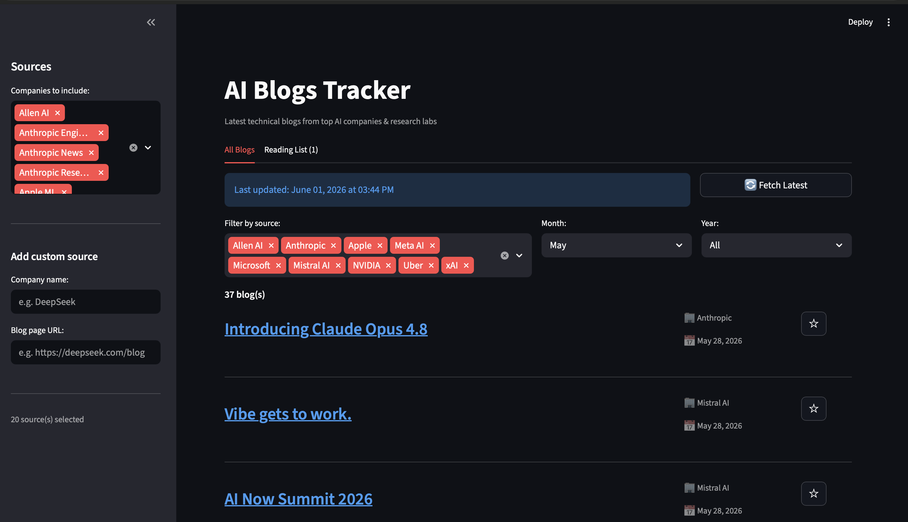

# AI Blogs Tracker

A Streamlit app that fetches and displays the latest technical blog posts from top AI companies and research labs — all in one place.

## Why?

Keeping up with AI moves fast. OpenAI, Anthropic, Google DeepMind, Meta, NVIDIA, Hugging Face, and 15+ others publish important research, engineering, and product blogs constantly. Instead of checking 20 sites manually, this app pulls the latest posts from all of them into a single feed with titles, dates, sources, and direct links.

## Screenshot




## How it works

1. **Tavily Extract** scrapes the blog listing pages of each company directly (not search — actual pages like `anthropic.com/engineering`, `openai.com/blog`, etc.)
2. **LLM (Claude)** parses the raw page content, extracts individual blog posts with titles, URLs, dates, and source names
3. **Streamlit** displays everything in a clean UI with filtering, favourites, and one-click links to the original posts

## Features

- **20 sources** tracked out of the box — covering AI labs, big tech, and independent researchers
- **Date filtering** — filter blogs by month and year to find exactly what you're looking for
- **Source filtering** — show/hide specific companies from results
- **Reading list** — star any blog to save it for later; persists across sessions in a local `reading_list.json`
- **Custom sources** — add any company's blog page URL from the sidebar
- **One-click fetch** — hit "Fetch Latest" to pull fresh content from all sources (~30s)

## Sources covered

| AI Labs | Big Tech | Research & Community |
|---------|----------|----------------------|
| OpenAI | NVIDIA | Hugging Face |
| Anthropic (News, Engineering, Research) | Meta AI | Allen AI |
| Google DeepMind | Apple ML | Berkeley AI (BAIR) |
| Mistral AI | Microsoft Research | Lilian Weng |
| Cohere | Uber Engineering | Interconnects |
| Together AI | Databricks | Simon Willison |
| Zhipu AI | Salesforce AI | |
| xAI | | |

Plus any custom source you add from the sidebar.

## Setup

### Prerequisites

- Python 3.13+
- [uv](https://docs.astral.sh/uv/) package manager
- A [Tavily](https://tavily.com) API key
- An LLM API key (configured for your endpoint in `LLM_Inference.py`)

### Install & run

```bash
# Clone the repo
git clone https://github.com/<your-username>/Blogs_Suggestion_Agent.git
cd Blogs_Suggestion_Agent

# Install dependencies
uv sync

# Set up your API keys
cp .env.example .env
# Edit .env and add your keys:
#   TAVILY_API_KEY=tvly-xxxxx
#   api_key=your-llm-api-key

# Run the app
uv run streamlit run app.py
```

The app opens at `http://localhost:8501`. Click **Fetch Latest** to load blogs.

## Configuration

- **Add/remove companies** from the sidebar multiselect
- **Add a custom source** by entering a company name and its blog page URL in the sidebar
- **LLM model** can be changed in `LLM_Inference.py` (defaults to `claude-sonnet-4-20250514`)

## Project structure

```
├── app.py              # Streamlit UI (tabs, filters, reading list)
├── blog_fetcher.py     # Tavily extraction + LLM parsing logic
├── LLM_Inference.py    # Reusable LLM call wrapper
├── pyproject.toml      # Dependencies
├── .env.example        # API key template
└── .env                # API keys (not committed)
```
